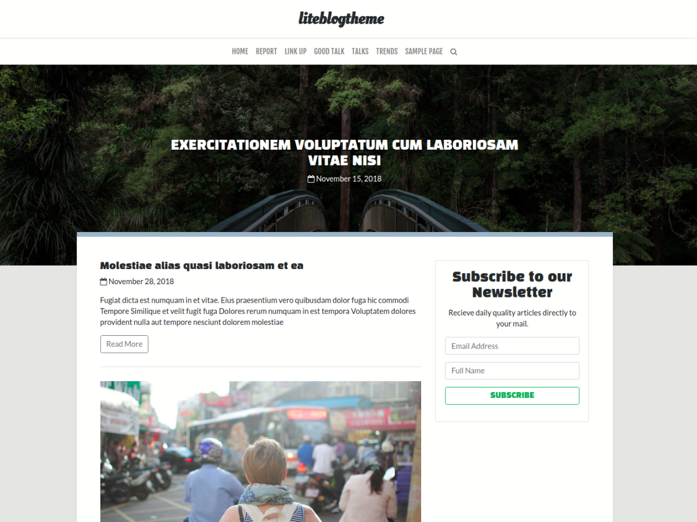

## Lite Blog theme for wordpress

Built using 

[bootstrap v4.1](https://getbootstrap.com)

[fontawesome 4.7](https://fontawesome.com)

[jQuery 3.3.1](https://jquery.com)

#### Getting started

clone this repository to your computer by either using the download button or git cloone from your terminal.

#### Todo

- Add comment system support

- Add custom theme color support through Wordpress customizer

- Add  support for custom google fonts

- Add support for custom icons

- Add support for wooecommerce **(Optional)**

- Add styles for wordpress widgets to fit theme look

#### Screenshot Preview

#### Features

Built lite Blog theme for as an easy to use and fits for most types of blogs with nice user interface and responsive views on any kind of screen size.

Theme has additional contact details for users such as social media profiles, has a featured post feature to show a post at the front-page as a single carousel style with post thumbnail as background image, theme also loads more post using ajax and some other features...

Watch or star this project to keep up with its development and progress.

#### Contribute

If you would love to contribute to this project please submit a pull request and I will do my best to merge properly.

For any issue, please create issue and I try as much to respond.

